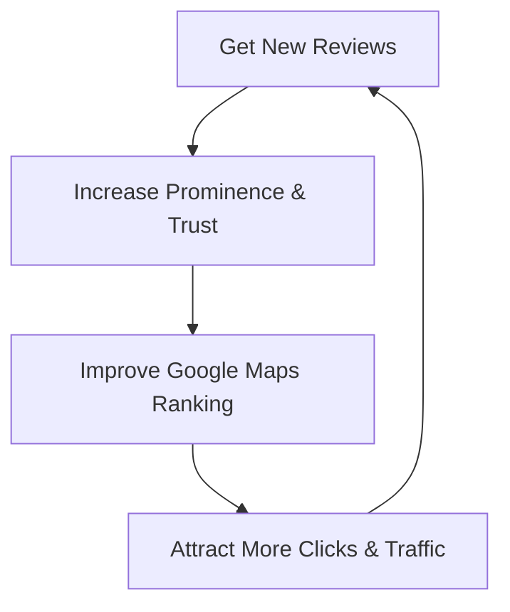

When a local customer searches for a service nearby—whether it is a "dentist in Chennai," a "boutique near me," or a "plumbing company in London"—they rarely scroll past the first page of search results. In fact, they rarely scroll past the map block at the very top. This prominent map section is known as the Google Local 3-Pack, and it is the single most valuable piece of digital real estate for any physical or service-area business today.

If your business does not appear in those top three map spots, you are practically invisible to local searchers. 

To bridge this gap, local businesses must master **Google Business Profile Optimization**. In this comprehensive guide, we will break down exactly how Google Business Profile Management works, how the Google Maps Ranking algorithm functions in 2026, and provide a step-by-step roadmap to optimize your profile to dominate your local market.

---

## What is a Google Business Profile?

A **Google Business Profile** (GBP), formerly known as Google My Business, is a free tool provided by Google that allows local businesses to manage their search footprint across Google Search and Google Maps. It acts as your company’s official digital storefront, displaying essential business information directly in search results.

When optimized correctly, your profile displays:
*   Your physical address and service area map.
*   Your primary and secondary business categories.
*   Your operational hours (including holiday hours).
*   Direct buttons to visit your website, call your staff, or get driving directions.
*   High-quality photos of your office, store, team, and services.
*   Real customer reviews and your responses.
*   Updates, promotions, and event posts.

In 2026, a Google Business Profile is no longer a passive listing; it is an active, interactive customer acquisition funnel.

---

## The Core Benefits of GBP Optimization

Many business owners claim their profiles and stop there, assuming that simply existing is enough. This is a massive mistake. Active **Google Business Profile Optimization** provides several critical advantages that directly impact your bottom line:

### 1. Massive Search Visibility
The Local 3-Pack sits above traditional organic search results. By optimizing your profile, you position your brand at the very top of high-intent search queries, capturing traffic before searchers even see standard organic listings.

### 2. High-Intent Lead Generation
Local searchers are ready to buy. A user searching for "emergency dentist near me" is looking to book an appointment immediately. Your optimized profile makes taking action simple, providing one-click access to call, chat, or map out directions.

### 3. Immediate Trust and Credibility
A complete profile featuring positive customer reviews, real photos, and active updates builds instant trust. Consumers trust profiles with recent, high-quality reviews far more than plain websites.

### 4. Zero Ad Cost
Unlike Google Ads, clicks on your Google Business Profile are 100% free. Achieving a top spot in the local map pack represents an ongoing stream of free organic leads.

### 5. Valuable Performance Insights
Your GBP dashboard provides detailed analytics on how customers find you. You can see the search queries driving clicks, the number of calls initiated, and requests for driving directions, allowing you to refine your overall **Local Business Marketing** strategy.

---

## How GBP Optimization Improves Local Rankings

To rank your profile, you need to understand how the **Google Maps Ranking** algorithm processes location-based data. Google uses three primary ranking pillars to determine which businesses deserve a spot in the Local 3-Pack:

### Pillar 1: Relevance
Relevance measures how closely your business profile details match the user’s search query. If your profile is vague or missing services, Google cannot connect you to relevant search terms. Proper optimization tells Google exactly what services you offer and where.

### Pillar 2: Proximity (Distance)
Proximity calculates how far your physical location is from the searcher (or the location specified in their query). While you cannot alter your physical address, you can optimize your profile's service areas and local schema on your website to ensure Google ranks you as far into your target radius as possible.

### Pillar 3: Prominence
Prominence measures your business's overall authority and popularity online. Google determines prominence based on:
*   **Directory consistency:** How consistently your Name, Address, and Phone number (NAP) are listed across the web.
*   **Review signals:** The volume, rating score, and frequency of your Google reviews.
*   **Organic website signals:** The SEO strength of the website linked to your profile.

---

## The Step-by-Step GBP Optimization Process

Ready to transform your profile from a basic listing into a conversion engine? Follow this step-by-step optimization process:

### Step 1: Claim and Verify Your Profile
Search for your business name on Google Maps. If you see "Own this business?", click it to start the verification process. Google will require verification via postcard, phone call, or email. Complete this immediately.

### Step 2: Select Your Categories Strategy
Your primary category carries the most weight in Google's ranking algorithm.
*   **Choose wisely:** If you are a dental clinic, choose "Dental Clinic" rather than a generic "Medical Center."
*   **Add secondary categories:** Select up to 9 secondary categories to capture related queries (e.g., "Cosmetic Dentist," "Teeth Whitening Service"). Do not select unrelated categories, as this confuses the algorithm.

### Step 3: Write a Keyword-Rich Business Description
Google allows up to 750 characters for your business description. 
*   **Write for humans first:** Explain who you are, what makes you unique, and the value you provide.
*   **Integrate local keywords:** Naturally include terms like "Local SEO services," "Google Business Profile Management," and your city name.
*   **Avoid promotions:** Google rejects descriptions containing sales pitches, pricing details, or coupon codes.

### Step 4: Standardize NAP Details
Consistency is critical for search engine trust.
*   Ensure your business name is your real legal name. Do not stuff it with keywords (e.g., writing "Joy Digital - Best SEO Agency in Chennai" is a guideline violation and can lead to profile suspension).
*   Your physical address must be identical to the address displayed on your website contact page and other local directories.
*   Use a local area code phone number if possible, as this reinforces your local presence.

### Step 5: Outline Your Service Areas and Hours
*   **Service Areas:** If you deliver services to customers' homes (like a plumber or a marketing consultant), define your service areas by zip codes or cities.
*   **Business Hours:** Keep your operational hours updated. If you close for holidays, update the special hours section in advance. Inaccurate hours frustrate customers and lead to negative reviews.

---

## How Reviews Impact Your Local Rankings

In 2026, online reviews are the lifeblood of **Local SEO**. They represent a direct ranking signal to Google's algorithm.

To leverage reviews for ranking success:
1.  **Request Reviews Consistently:** Set up a system to ask customers for feedback immediately after a purchase or service. Use your short review link (found in your GBP dashboard) to make the process easy.
2.  **Encourage Keyword-Rich Reviews:** When customers write reviews, they naturally describe your service. Reviews containing terms like "best local SEO agency" or "great dental clinic in Chennai" help boost your rankings for those specific keywords.
3.  **Reply to Every Review:** Respond to both positive and negative reviews. A professional reply to a negative review shows prospective clients that you care about customer satisfaction and actively manage your business.

---

## The Power of Photos and Posts

An active profile is a ranking profile. Google monitors how often you update your listing to ensure your business is still operational.

### Photos: The Visual Trust Signal
Profiles with high-quality photos receive 42% more requests for directions and 35% more clicks to their website than listings without photos.
*   **Types of photos:** Upload exterior shots (helps customers find you), interior design, team members, and before-and-after project photos.
*   **Format:** Use clear, unedited JPEG or PNG files. Avoid stock photography, as Google's AI can identify stock images and may remove them.

### Google Business Posts: Keep Customers Updated
Use Google Posts to share updates directly in search results.
*   **What to post:** Share product launches, seasonal offers, industry articles, and event details.
*   **Include a CTA:** Every post should include a call-to-action button, such as "Call Now," "Book Now," or "Learn More" (linking to your website).

---

## Common Google Business Profile Management Mistakes to Avoid

Avoid these frequent mistakes that can hurt your rankings or, worse, get your profile suspended:

1.  **Keyword Stuffing the Business Name:** Adding keywords like "Best Web Design Agency" to your title if it is not your legal name is a violation of Google's terms of service.
2.  **Using P.O. Boxes or UPS Store Addresses:** Google requires a physical street address or a defined service area. Virtual offices and P.O. boxes are prohibited.
3.  **Duplicate Listings:** Having multiple profiles for the same business location splits your review power and confuses search engines. Merge or delete duplicates immediately.
4.  **Buying Fake Reviews:** Google's spam filters are highly advanced. Fake reviews will be flagged and removed, and your profile may face suspension.

---

## Google Business Profile Optimization Checklist

Use this quick checklist to track your optimization progress:

| Task | Frequency | Priority |
| :--- | :--- | :--- |
| Claim and verify your profile | One-time | High |
| Select correct primary and secondary categories | One-time | High |
| Write an optimized 750-character description | One-time | Medium |
| Verify NAP consistency across all directories | Monthly | High |
| Upload new, high-quality team and project photos | Weekly | Medium |
| Ask satisfied customers for reviews | Weekly | High |
| Respond to all incoming customer reviews | Within 24 Hours | High |
| Publish a Google Business Post | Weekly | Low |

---

## Frequently Asked Questions

### Q1: Is a Google Business Profile really free?
Yes. Creating, optimizing, and managing a Google Business Profile is 100% free. Google does not charge local businesses to appear in Google Maps or local search results.

### Q2: How long does it take to see results from GBP optimization?
Depending on your industry competition and location, you can start seeing increases in map impressions, calls, and website clicks within 30 to 45 days of completing your profile optimization.

### Q3: Why is my Google Business Profile suspended?
Suspensions usually happen due to a violation of Google's guidelines, such as using a virtual address, keyword stuffing your business name, or listing duplicate addresses. You must submit a reinstatement request with proof of physical operation to resolve it.

### Q4: Can I rank on Google Maps if I don't have a physical store?
Yes. If you operate a service-based business (like a mobile mechanic or consultant) and work at clients' locations, you can register as a "Service Area Business" and hide your physical address while still ranking in your target cities.

### Q5: How do I handle negative reviews?
Never ignore them. Respond promptly and professionally. Apologize for their poor experience, explain how you intend to resolve the issue, and invite them to discuss the matter privately via email or phone.

---

## Dominate Your Local Market with Joy Digital

Optimizing your Google Business Profile is the most cost-effective way to get more local customers, but it requires continuous monitoring, review acquisition strategy, and algorithm updates. At **Joy Digital**, we specialize in professional **Google Business Profile Management** and **Local SEO** services. 

We audit your listing, fix directory inconsistencies, optimize category structures, and implement review systems designed to rank your business #1 on Google Maps.

Ready to grow your local search presence? [Contact Joy Digital today](file:///c:/Users/SARAVANAN/OneDrive/Desktop/joydigital1/contact) for a free local audit, or schedule a consultation with our search specialists. Let’s make your business the top choice in your city!
